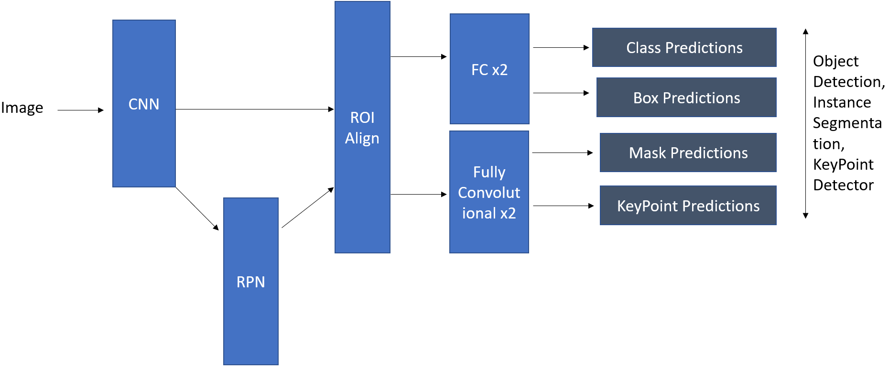
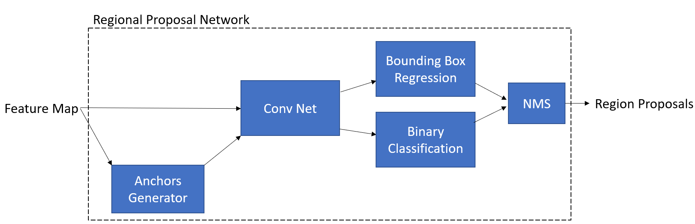
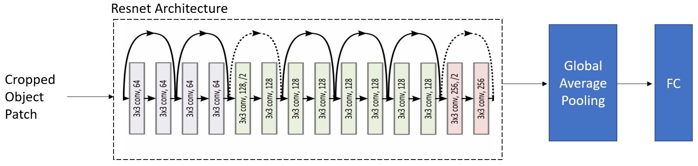
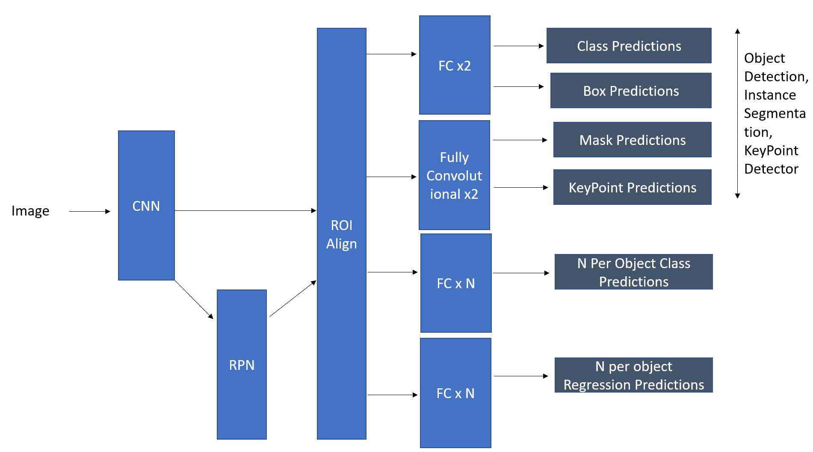
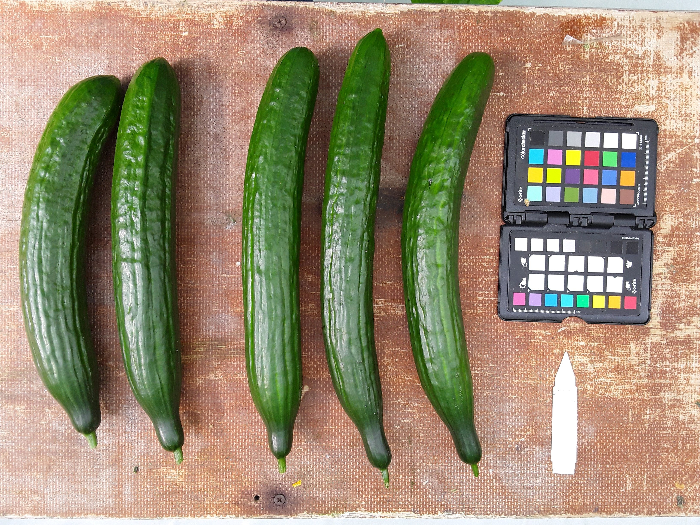
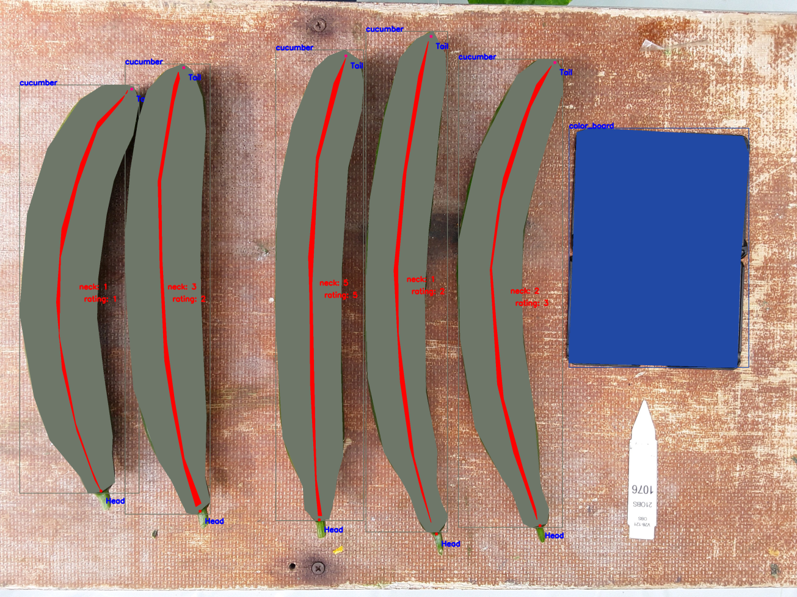
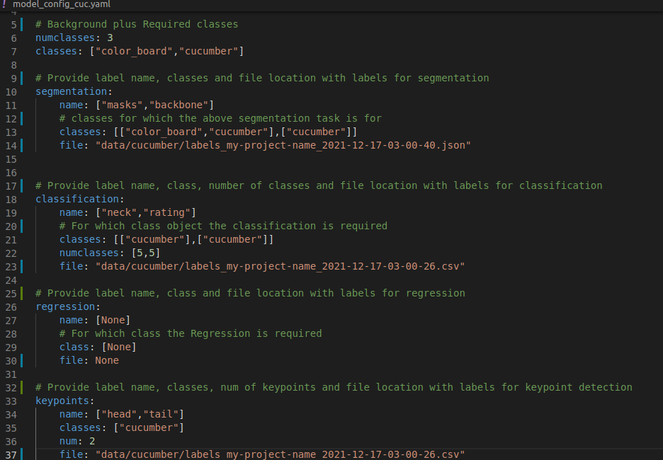

## All with One Image Net (SMN)
##  

A Scaleable MultiTask Network Framework for image-based Object detection, Instance segmenation, Keypoint detection, Classification and Regression. We want to solve all the taks of OD, Instance segmentation, KP detection, Detected objects classifications and regressions. Typically there are two way to approach this.

* MaskRCNN with Keypoint Detector + Seperate CNN for per fruit Classification/Regression
First CNN network is for detection, segmentation, and keypoint detection like MaskRCNN which extracts the fruit patches or ROIs which are then fed to another network for multilabel classification and regression of each fruit. In our example case N=2 for Neck and rating but in general can be N classification and N regression problems.

  

    
  

  
  
  

    
  

  
  

    
  

* The second way is multi task learning. We propose here a multitask network with configureable inputs and that can be exapnded to do N segmentaiton,N classification and N regression tasks where N can be specified by a config file

    
  

  This work provides a general way to do second type of multi task learning in a more general scaleable and userfriendly way

## Example
We will motivate with a real world example. Suppose we want to do vegetable phenotyping(Finding the traits of vegetables) using imaging. We are intetrested in multiple traits of each fruit for example length, width, shape uniformity, backbone(curved_height), Head,Tail, Neck and overall rating of each fruit. In summary we for this example we are interested in follwing traits of fruits 
1) Max Length and width of fruit, can be found by bounding boxes of objects (Object Detection)
2) Shape uniformity and length and width at different points of fruit, can be found by finding mask for each fruit (Instance segmentation)
3) Backbone(Curved Height), can be found by by finding masks of backbone (Instance semgentation)
4) Head and Tail of fruits are used for orientation correction of fruit, can be thought of image keypoint detection (Keypoint detection)
5) Neck and rating of fruit is determied by breeder and is given a categorical score form 1-5. where 1 is bad and 5 is good, they can be though of classification problem
So we have object detection problem, instance segmtentation problem multiple multi class classification problems per objects and keypoint detection problem
### Example Input Image
  

    
  
 
  
### Example Annotated Image
  

    
  

### Proposed Framework
In this framework we can specify all the tasks using a config file as shown below

  

    
  

