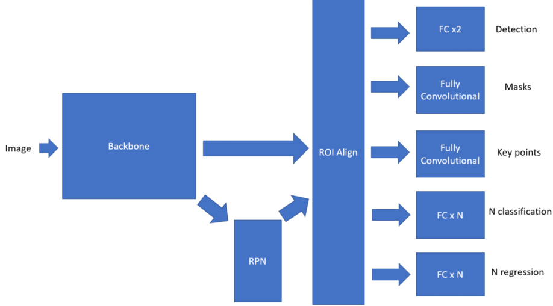

## All with One Image Net (SMN)
##  

A Scaleable MultiTask Network Framework for image-based Object detection, Instance segmenation, Keypoint detection, Classification and Regression.
Our purpose is to solve to main problems while using deep neural network for production

1. Train a single multitask network with shared bakbone instead of adding a seperate network per task
2. Handle dataset with sparse supervision

### Example Multi Task 
  

    
  

### Example Sparse Supervision
  

    
  

  
* Pipeiline of an Instance segmentation network like MaskRCNN with Keypoint Detector followed by seperate CNNs for per fruit classification/regression
 
First CNN network is for detection, segmentation, and keypoint detection like MaskRCNN which extracts the fruit patches or ROIs which are then fed to another network for multilabel classification and regression of each fruit. Figures below show this pipeline

  

    
  

                                        

  

    
  

  
  
  

    
  

  
  

    
  

* The second way is multi task learning. We propose here a multitask network with configureable inputs and that can be exapnded to do N segmentaiton,N classification and N regression tasks where N can be specified using a simple config file. The idea is to use shared features between task and use ROIs generated by RPN network to narrow the area of classification and regression. Giving whole input image to the network and performing multilabel classficiation and regression can require a lot of data so using ROIs provide a inductive bias to reduce the amount of data for training. Multitask networks in addition to providing better generalizations aslo can be paralleleized and be computed very efficently.

    
  

  This work provides a general way to do second type of multi task learning in a more general scaleable and userfriendly way

## Example
We will motivate with a real world example. Suppose we want to do fruit level phenotyping (Finding the visual traits of fruits) using imaging. We are intetrested in multiple traits of each fruit for example length, width, shape uniformity, backbone(curved_height), head, tail, neck and overall rating of each fruit. In summary we for this example we are interested in follwing traits of fruits 
1) Max Length and width of fruit, can be found by bounding boxes of objects (Object Detection)
2) Shape uniformity and length and width at different points of fruit, can be found by finding mask for each fruit (Instance segmentation)
3) Backbone (Curved Height), can be found by by finding masks of backbone (Instance semgentation)
4) Head and Tail of fruits are used for orientation correction of fruit, can be thought of image keypoint detection (Keypoint detection)
5) Neck and rating of fruit is determied by breeder and is given a categorical score form 1-5. where 1 is bad and 5 is good, they can be though of classification problem
In summary, we have object detection problem, multiple instance segmtentation problem, multiple multi label multi class classification problems and keypoint detection problem

### Example Input Image
  

    
  
 
  
### Example Annotated Image
  

    
  

  
### Prediction Results using multitask network

  

    
  

### Training and Predictions

1) Install requirements using pip install -r requirements.txt
2) In this framework we can specify all the tasks using a config file as shown below.Modify the config file according to the task
  
  

    
  

  
3) To train the netowrk run train_vegnet.py  
4) To predcit run predict_vegnet.py 

***Quantitive results on each task for the private dataset to be released soon!!***

