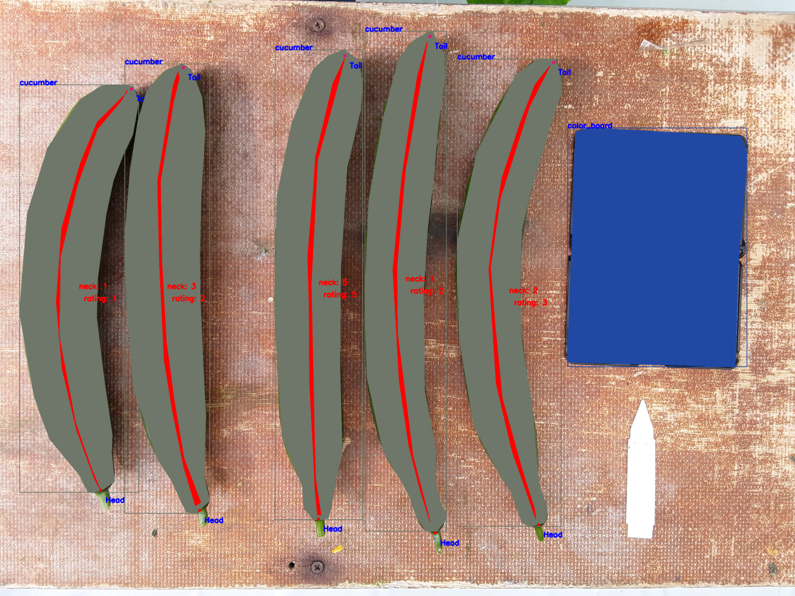

## All with One Image Net (SMN)
##  

A Scaleable MultiTask Network Framework for image-based Object detection, Instance segmenation, Keypoint detection, Classification and Regression.
Our purpose is to solve to main problems while using deep neural network in production

1. Design scaleable multitask network with shared bakbone
2. Handle dataset with sparse supervision

### Example Multi Task 

In an image we want to detect cucumbers, color board segment fruits, segment their backbone, and also classify there neck and overall rating
  

    
  

  
### Example Sparse Supervision Data

  

    
  

  
## Training MultiTask Network for two tasks using Sparse Data
  

    
  

                

## Background

* Pipeiline of an Instance segmentation network like MaskRCNN with Keypoint Detector followed by seperate CNNs for per fruit classification/regression
 
First CNN network is for detection, segmentation, and keypoint detection like MaskRCNN which extracts the fruit patches or ROIs which are then fed to another network for multilabel classification and regression of each fruit. Figures below show this pipeline

  

    
  

  
  
  

    
  

  
  

    
  

* The second way is multi task learning. We propose here a multitask network with configureable inputs and that can be exapnded to do N segmentaiton,N classification and N regression tasks where N can be specified using a simple config file. The idea is to use shared features between task and use ROIs generated by RPN network to narrow the area of classification and regression. Multitask networks in addition to providing better generalizations aslo can be paralleleized and be computed very efficently.

### Training and Predictions

1) Install requirements using pip install -r requirements.txt
2) The netowrk can be seamless extended to handle more tasks by changing the config file

  
3) To train the netowrk run train_vegnet.py  
4) To predcit run predict_vegnet.py 

***Quantitive results on each task for the private dataset to be released soon!!***

